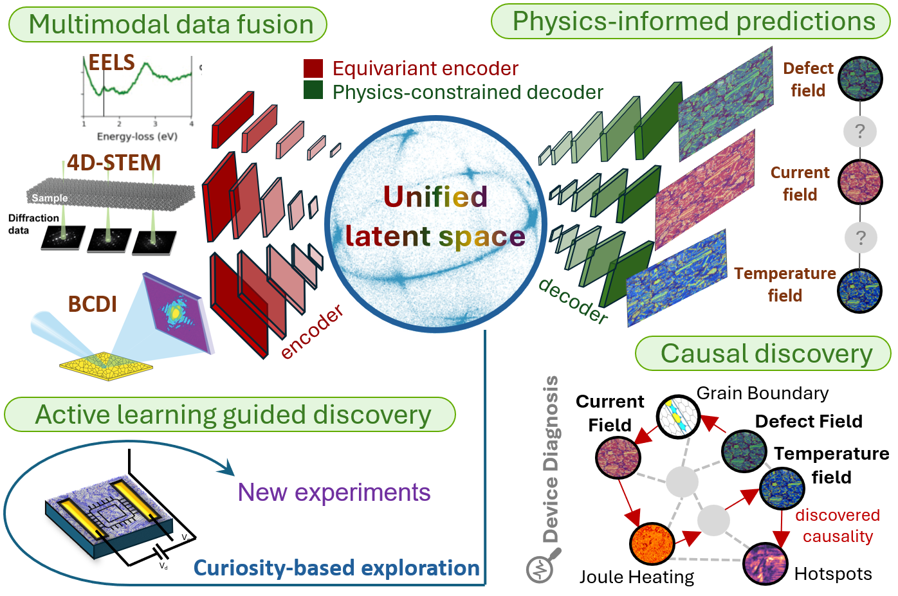

# AlphaFold for Microelectronics

### Decoding defect-mediated mechanisms governing stability and function

A physics-informed AI initiative to predict how defects form, evolve, and shape the electrical, thermal, and mechanical performance of next-generation microelectronics.

---

## Why this matters

Heterogeneous integration is rapidly increasing the number and complexity of interfaces in microelectronic devices. Vacancies, dislocations, voids, chemical disorder, and interfacial contamination can govern leakage, switching instability, heat flow, adhesion loss, delamination, and device lifetime.

> **Our goal:** connect composition, geometry, bias, and temperature to defect evolution, functional fields, and reliability.

## Research focus

| | Focus area | What we want to predict |
|---|---|---|
| 🧩 | **Defect and interface evolution** | How vacancies, non-stoichiometry, dislocations, and voids form and change during synthesis and operation |
| 🔬 | **Thin-film structure and dynamics** | How polymorphism, polycrystallinity, and grain boundaries control transport and defect networks |
| ⚡ | **Heterogeneous integration** | How defect chemistry and bonding changes lead to adhesion loss, crack nucleation, and delamination |

## From multimodal data to predictive models

1. **Unify heterogeneous data** from imaging, spectroscopy, scattering, electrical and thermal measurements, and multiscale simulation.
2. **Enforce physical laws** with physics-informed models that predict electrostatic potential, current density, and temperature.
3. **Guide new experiments** through uncertainty-aware active learning and multi-fidelity optimization.
4. **Identify mechanisms—not just correlations** using causal models of defect–field–functionality relationships.

  

<em>Figure 4. Four core components of the proposed framework: integration and curation of heterogeneous datasets, refined physics-informed AI methods, active learning-guided discovery, and causal learning of defect–property relationships.</em>

The effort draws on capabilities across DOE user facilities and leadership computing centers, spanning atomic-resolution microscopy, coherent X-ray methods, spectroscopy, device measurements, and simulations from electronic structure to continuum scales.

## Repository overview

This organization will host a growing set of complementary tools and models. Each repository covers one part of the broader framework.

| Repository | Role in the project |
|---|---|
| [**AI-DINO**](https://github.com/AlphaFold-for-Microelectronics/AI-DINO) | **AI for Dynamic Imaging of Nanoscale Objects.** A differentiable, GPU-accelerated PyTorch framework for simulating Bragg coherent diffraction imaging from crystalline nanostructures, with direct and FFT scattering methods designed for optimization and machine-learning workflows. |

---

  Predict defects. Resolve fields. Design for reliability.

